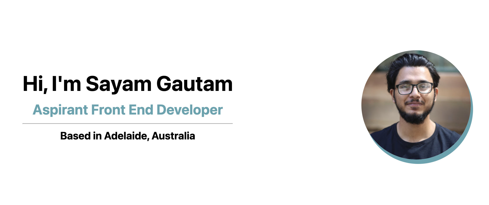

# profesional-portfolio

```md

```

[Portfolio website](https://sayamgautam1.github.io/profesional-portfolio/)

## Description

The objective of this task is to have a last portfolio, exhibiting the work completed amid the course. It moreover serves as a put to hone and apply concepts learned and change the folio in accordance

## Purpose

# To achieve the said task given

AS AN employer
I WANT to view a potential employee's deployed portfolio of work samples
SO THAT I can review samples of their work and assess whether they're a good candidate for an open position

## Built With

# HTML

# CSS

# Font awesome
